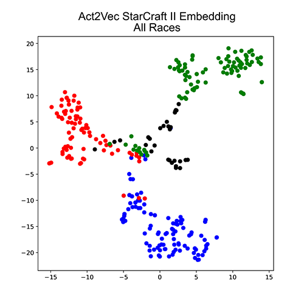

# The Natural Language of Actions

This repository contains code for [ICML 2019 The Natural Language of Actions](https://arxiv.org/abs/1902.01119).
```
@inproceedings{tennenholtz2019natural,
  title={The Natural Language of Actions},
  author={Tennenholtz, Guy and Mannor, Shie},
  booktitle={ICML},
  year={2019}
}
```

## About 
The code is divided into the three domains tested in the original paper: QuickDraw,
Navigation, and StarCraft2.



## Datasets
All three folders contain the corpus of actions used, except for StarCraft2, where the file size of
the corpus was very large. For the case of StarCraft2 a sample of the action corpus is
provided, which is enough to get a noisy estimate of the same results. Those who are interested can use [PySC2](https://github.com/deepmind/pysc2)
to download more replays and train their own Act2Vec model on them.

Trained Act2Vec embeddings of all three environments are provided.

The Quick,Draw! dataset can be found in https://github.com/googlecreativelab/quickdraw-dataset.
We have provided the square category used in the paper.

For StarCraft II we divided the action space into the three races - available in three separate
json files: terran_actions.json, protoss_actions.json, and zerg_actions.json.
common_action.json includes all actions that are common to all races (such as moving the
camera).

## Using the Code

### preprocess.py
Responsible for creating embeddings using the
provided action corpus. There are a lot of interesting parameters to play with including:
continuous embedding, window width, embedding dimension, bag of words context, and
more.

### plot_embeddings.py
Plots the trained Act2Vec embeddings.

### Environments
QuickDraw/rect_painter_trainer.py will train the square agent. Make sure to input the test and
parameters you want. Tests available are: action2vec, action2vec_normalized, one_hot, or
random. An example of use:
```
python3 QuickDraw/rect_painter_trainer.py action2vec --embedding_dim 10 --window 2 --square_size 12 --n_iters 10000000 --n_trials 15 --gpu 0 --save_id 0
```
The QuickDraw environment uses stable_baselines - but we have modified it a bit. The modified version is included in the QuickDraw/stable_baselines folder.

Navigation/rl_3d is based on the GitHub repository: https://github.com/avdmitry/rl_3d. Training is done similarly as explained on their GitHub page. We added parameters relating to
using action embeddings with Q-embedding and k-Exp.